# Visual Diagrams for Git & CI/CD Training

These diagrams are in Mermaid format and can be rendered in:
- Azure DevOps Wiki
- GitHub/GitLab
- VS Code with Mermaid extension
- Online at mermaid.live
- Many Markdown viewers

---

## Diagram 1: Git Commits as Snapshots

```mermaid
flowchart TB
    subgraph TITLE[" "]
        direction TB
        T1["<b>Git Commits as Snapshots</b>"]
        T2["Each commit captures the COMPLETE state of your repository —"]
        T3["not just the files you changed."]
    end
    
    subgraph COMMITS[" "]
        direction TB
        
        subgraph C1["Commit 1"]
            direction TB
            A1["📊 Sales Model"]
            B1["📈 Report A"]
            C1F["📈 Report B"]
            D1["📁 Pipeline"]
        end
        
        subgraph C2["Commit 2"]
            direction TB
            A2["📊 Sales Model"]
            B2["📈 Report A ⭐"]
            C2F["📈 Report B"]
            D2["📁 Pipeline"]
        end
        
        subgraph C3["Commit 3"]
            direction TB
            A3["📊 Sales Model ⭐"]
            B3["📈 Report A"]
            C3F["📈 Report B"]
            D3["📁 Pipeline"]
        end
        
        C1 -->|"Edit Report A"| C2
        C2 -->|"Edit Sales Model"| C3
    end
    
    subgraph KEYPOINT[" "]
        direction TB
        K1["<b>Key Point:</b> Each commit contains ALL items."]
        K2["⭐ = changed in that commit"]
        K3["Git efficiently stores unchanged items by reference, not by copying."]
    end
    
    TITLE ~~~ COMMITS
    COMMITS ~~~ KEYPOINT
    
    style TITLE fill:none,stroke:none
    style KEYPOINT fill:#FFFACD,stroke:#DAA520
    style T1 fill:none,stroke:none
    style T2 fill:none,stroke:none
    style T3 fill:none,stroke:none
    style K1 fill:none,stroke:none
    style K2 fill:none,stroke:none
    style K3 fill:none,stroke:none
    style B2 fill:#90EE90
    style A3 fill:#90EE90
```



---

## Diagram 2: The Feature Branch Workflow (Phase 3)

This diagram shows how a single developer works on a feature branch while the main branch continues to evolve.


**Reading this diagram:**
- **Main branch (top line)**: The shared branch connected to the Development workspace. It keeps moving forward with other team members' work.
- **Feature branch (bottom line)**: Your isolated workspace. You work here without affecting Main.
- **Merge point**: After PR approval, your feature joins Main and syncs to the Dev workspace.

---

## Diagram 3: Your CI/CD Pipeline Flow

```mermaid
flowchart TB
    subgraph TITLE[" "]
        T1["<b>CI/CD Pipeline Flow — All Three Phases</b>"]
        T2["Shows how work flows from Feature development through to Production"]
    end

    subgraph Phase3["Phase 3: Feature Development"]
        DEV_TEAM[("👥 Dev Team")]
        FW["🖥️ Feature<br/>Workspace"]
        FB[("🌿 Feature<br/>Branch")]
        
        DEV_TEAM -->|"Pull/Push"| FB
        FB -->|"Sync"| FW
    end
    
    subgraph Phase1["Phase 1: Main Integration"]
        MAIN[("🌳 Main<br/>Branch")]
        DEV_WS["🖥️ Development<br/>Workspace"]
        
        FB -->|"Pull Request<br/>+ Approval"| MAIN
        MAIN -->|"Sync"| DEV_WS
    end
    
    subgraph Phase2["Phase 2: Deployment Pipeline"]
        TEST_WS["🖥️ Test<br/>Workspace"]
        PROD_WS["🖥️ Production<br/>Workspace"]
        RM[("👤 Release<br/>Manager")]
        
        DEV_WS -->|"Deploy"| TEST_WS
        TEST_WS -->|"Deploy"| PROD_WS
        RM -.->|"Controls"| DEV_WS
        RM -.->|"Controls"| TEST_WS
        RM -.->|"Controls"| PROD_WS
    end

    subgraph KEYPOINT[" "]
        K1["<b>Key Points:</b>"]
        K2["• Phase 1: Engineers commit to Main, which syncs to Dev workspace"]
        K3["• Phase 2: Release Manager deploys through pipeline stages"]
        K4["• Phase 3: Engineers work in isolated Feature branches/workspaces"]
    end
    
    TITLE ~~~ Phase3
    Phase2 ~~~ KEYPOINT
    
    style TITLE fill:none,stroke:none
    style T1 fill:none,stroke:none
    style T2 fill:none,stroke:none
    style KEYPOINT fill:#FFFACD,stroke:#DAA520
    style K1 fill:none,stroke:none
    style K2 fill:none,stroke:none
    style K3 fill:none,stroke:none
    style K4 fill:none,stroke:none
    style MAIN fill:#228B22,color:#fff
    style FB fill:#4169E1,color:#fff
    style PROD_WS fill:#FFD700
```



---

## Diagram 4: Pull Request Lifecycle

```mermaid
flowchart TB
    subgraph TITLE[" "]
        T1["<b>Pull Request Lifecycle</b>"]
        T2["The process from completing your feature to merging into Main"]
    end

    subgraph FLOW[" "]
        A[Feature Complete in<br/>Feature Workspace] --> B[All Changes Committed]
        B --> C[Create Pull Request<br/>in Azure DevOps]
        C --> D{Reviewers<br/>Assigned}
        D --> E[Review Period]
        E --> F{Feedback?}
        F -->|Changes Requested| G[Make Updates in<br/>Feature Workspace]
        G --> H[Commit Fixes]
        H --> E
        F -->|Approved| I{All Approvals<br/>Received?}
        I -->|No| E
        I -->|Yes| J[Merge to Main]
        J --> K[Changes Sync to<br/>Dev Workspace]
        K --> L[Delete Feature Branch]
    end
    
    subgraph KEYPOINT[" "]
        K1["<b>Key Points:</b>"]
        K2["• PRs enable code review before changes reach Main"]
        K3["• Address feedback by committing fixes to your feature branch"]
        K4["• After merge, your changes automatically sync to Dev workspace"]
    end
    
    TITLE ~~~ FLOW
    FLOW ~~~ KEYPOINT
    
    style TITLE fill:none,stroke:none
    style FLOW fill:none,stroke:none
    style T1 fill:none,stroke:none
    style T2 fill:none,stroke:none
    style A fill:#4169E1,color:#fff
    style J fill:#228B22,color:#fff
    style K fill:#90EE90
    style KEYPOINT fill:#FFFACD,stroke:#DAA520
    style K1 fill:none,stroke:none
    style K2 fill:none,stroke:none
    style K3 fill:none,stroke:none
    style K4 fill:none,stroke:none
```



---

## Diagram 5: Daily Workflow Decision Tree

```mermaid
flowchart TB
    subgraph TITLE[" "]
        T1["<b>Daily Workflow Decision Tree</b>"]
        T2["Follow this pattern every day to build good Git habits"]
    end

    subgraph FLOW[" "]
        START([Start of Day]) --> CHECK{Updates<br/>Pending?}
        CHECK -->|Yes| PULL[Pull/Sync Updates]
        CHECK -->|No| WORK
        PULL --> WORK[Do Your Work]
        WORK --> SAVE{Logical<br/>Checkpoint?}
        SAVE -->|Yes| COMMIT[Commit with<br/>Clear Message]
        SAVE -->|No| WORK
        COMMIT --> MORE{More Work<br/>Today?}
        MORE -->|Yes| WORK
        MORE -->|No| EOD([End of Day])
    end
    
    subgraph KEYPOINT[" "]
        K1["<b>Key Points:</b>"]
        K2["• Always sync/pull BEFORE starting work"]
        K3["• Commit at logical checkpoints, not just end of day"]
        K4["• Never leave uncommitted work overnight"]
    end
    
    TITLE ~~~ FLOW
    FLOW ~~~ KEYPOINT
    
    style TITLE fill:none,stroke:none
    style FLOW fill:none,stroke:none
    style T1 fill:none,stroke:none
    style T2 fill:none,stroke:none
    style START fill:#4169E1,color:#fff
    style EOD fill:#228B22,color:#fff
    style COMMIT fill:#90EE90
    style KEYPOINT fill:#FFFACD,stroke:#DAA520
    style K1 fill:none,stroke:none
    style K2 fill:none,stroke:none
    style K3 fill:none,stroke:none
    style K4 fill:none,stroke:none
```



---

## Diagram 6: Conflict Resolution Flow

```mermaid
flowchart TB
    subgraph TITLE[" "]
        T1["<b>Conflict Resolution Flow</b>"]
        T2["What to do when Git detects conflicting changes"]
    end

    subgraph FLOW[" "]
        A[Attempt to Merge/Sync] --> B{Conflict<br/>Detected?}
        B -->|No| C[✅ Success!]
        B -->|Yes| D[Identify Conflicting Items]
        D --> E[Talk to Other Contributor]
        E --> F{Resolution<br/>Strategy}
        F -->|Keep Mine| G[Select Your Version]
        F -->|Keep Theirs| H[Select Their Version]
        F -->|Combine| I[Manually Merge<br/>Both Changes]
        G --> J[Mark Resolved]
        H --> J
        I --> J
        J --> K[Commit Resolution]
        K --> C
        
        F -->|Unsure| L[Escalate to Lead]
        L --> F
    end
    
    subgraph KEYPOINT[" "]
        K1["<b>Key Points:</b>"]
        K2["• Conflicts happen when two people change the same item"]
        K3["• Communication is key — talk to the other contributor"]
        K4["• When unsure, escalate rather than guess"]
        K5["• Prevention: Keep feature branches short-lived"]
    end
    
    TITLE ~~~ FLOW
    FLOW ~~~ KEYPOINT
    
    style TITLE fill:none,stroke:none
    style FLOW fill:none,stroke:none
    style T1 fill:none,stroke:none
    style T2 fill:none,stroke:none
    style C fill:#90EE90
    style L fill:#FFD700
    style KEYPOINT fill:#FFFACD,stroke:#DAA520
    style K1 fill:none,stroke:none
    style K2 fill:none,stroke:none
    style K3 fill:none,stroke:none
    style K4 fill:none,stroke:none
    style K5 fill:none,stroke:none
```



---

## Diagram 7: Deployment Pipeline Stages


---

## Diagram 8: Commit History Visualization

This diagram uses Mermaid's native gitGraph syntax to show a linear commit history.


**Reading This Diagram:**
- Each node is a commit (a complete snapshot of the entire repo)
- You can "checkout" any commit to see the repo at that point in time
- Tags (v1.0, v1.1) mark important milestones like releases
- Commit messages describe WHAT changed in each snapshot

**Key Points:**
- History is a chain of snapshots, not a chain of changes
- You can always go back to any previous snapshot
- Good commit messages make history useful and searchable

---

## How to Render These Diagrams

### Option 1: Mermaid Live Editor
1. Go to [mermaid.live](https://mermaid.live)
2. Paste the code between the ```mermaid and ``` markers
3. Export as PNG or SVG

### Option 2: VS Code
1. Install "Markdown Preview Mermaid Support" extension
2. Open this file
3. Preview will render diagrams

### Option 3: Azure DevOps Wiki
1. Create a wiki page
2. Paste Mermaid code blocks directly
3. They render automatically

### Option 4: Export for PowerPoint
1. Use mermaid.live to export as SVG
2. Import SVG into PowerPoint
3. Or export as PNG for simpler insertion

---

*These diagrams are designed to complement the BI Engineer Training Plan and Quick Reference Cards.*
